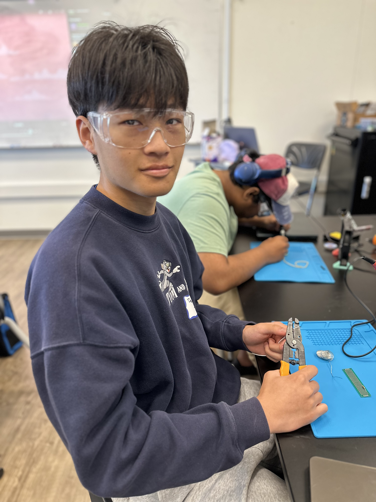
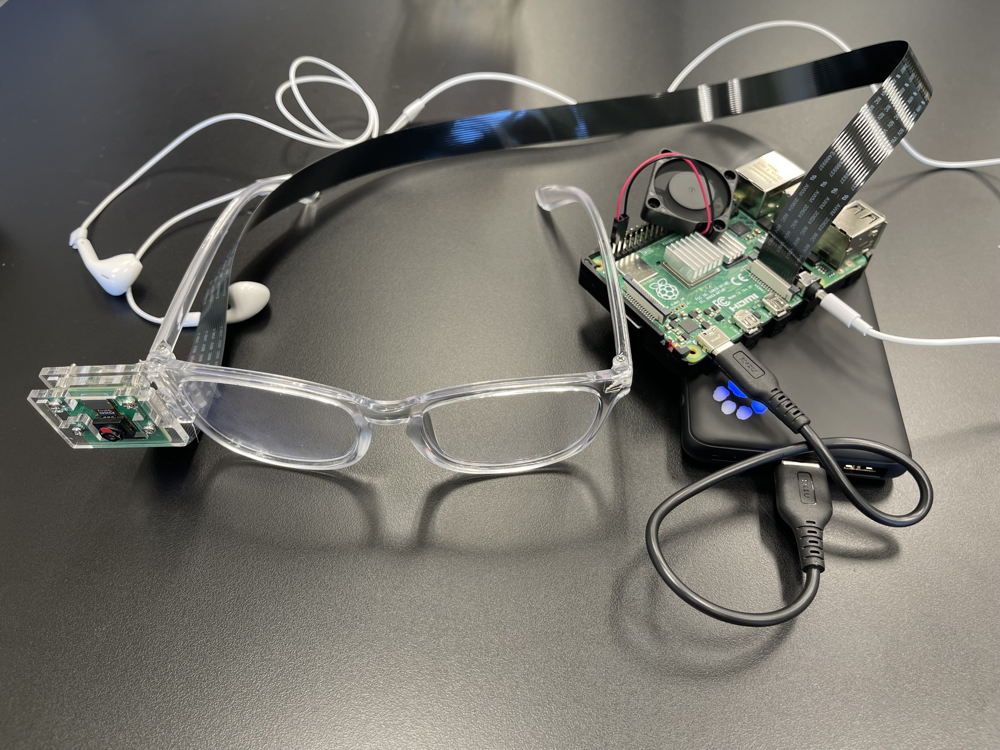
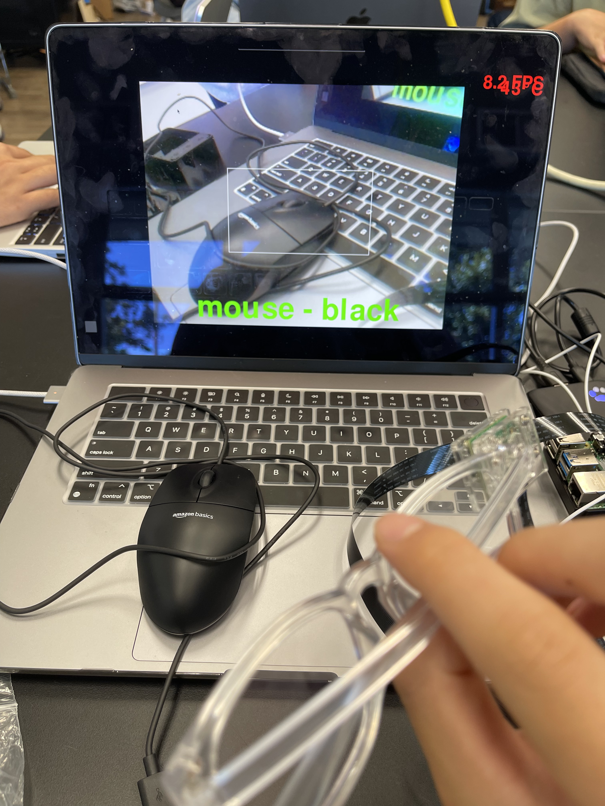
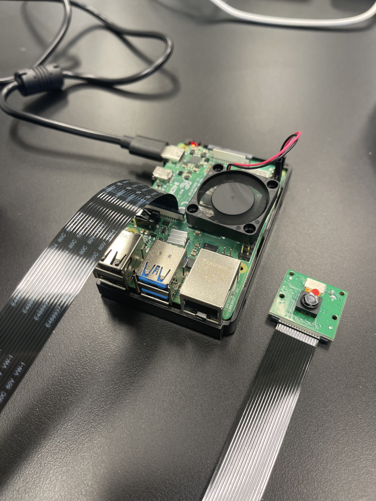
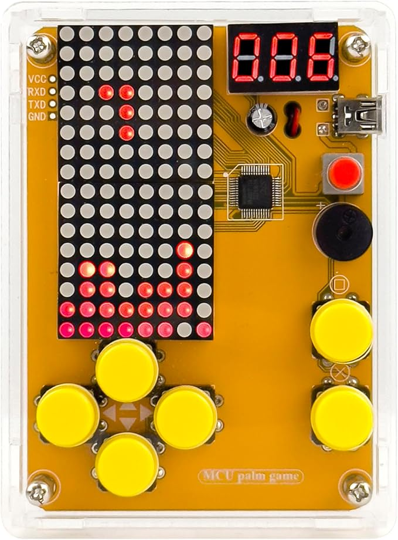

# Smart Glasses
<!-- Replace this text with a brief description (2-3 sentences) of your project. This description should draw the reader in and make them interested in what you've built. You can include what the biggest challenges, takeaways, and triumphs from completing the project were. As you complete your portfolio, remember your audience is less familiar than you are with all that your project entails! -->
The Smart Glasses uses object recognition and text to speech which lets the user recognize the object without seeing it. The Raspberry Pi and camera module work together to recognize the object using a pretrained models. Then, the Raspberry Pi reads the object into earbuds attached to the Raspberry Pi and glasses.


| **Engineer** | **School** | **Area of Interest** | **Grade** |
|:--:|:--:|:--:|:--:|
| Derek Y | Los Gatos High School | Electrical Engineering | Incoming Junior




<!--# Modifications

### Summary
I made a picture taking system where the camera will automatically take a picture if it recognizes an object. This will be stored in a folder, where the user can access it and check the accuracy of the detection. I also set a cooldown where the code checks if it took a picture of a certain object in the past 10 seconds, and does not allow a duplicate photo. This cooldown makes it so the pictures folder where the images are saved will not be spammed with the same picture, which saves storage. 

Improved accuracy of color recognition
   Used HSV values rather than RGB values
   BGR to HSV because OpenCV takes BGR values
   Works way better and more accurate, 
   Added color rgb values and name to UI
### Challenges
Some challenges I had while working on modifications were 
-->


# Final Milestone
<iframe width="560" height="315" src="https://www.youtube.com/embed/BSQoRLgTWyA?si=n3A9D1DcvZPADYvk" title="YouTube video player" frameborder="0" allow="accelerometer; autoplay; clipboard-write; encrypted-media; gyroscope; picture-in-picture; web-share" referrerpolicy="strict-origin-when-cross-origin" allowfullscreen></iframe> 

### Summary
For this milestone, I enabled text to speech within the object recognition system. I simply turned the volume up and the text to speech started working. I used the festival python wrapper which enabled text to speech directly from the object recognition code. When the Pi camera detects an object, the user will hear it through the earbuds. I also assembled the glasses for this milestone. I made it portable by attaching a power bank instead of using a power outlet. I also replaced my short camera flex cable with a long one, so I can hold onto the Raspberry Pi while the camera is attached to the glasses. Then, I hotglued the camera to the glasses. Since I didn't want to put hot glue directly on the PCB, I built the camera mount without the legs. This made a clear protective box for the camera, which I could put hot glue on and attach to the glasses. After that, I tested my object recognition with the newly assembled glasses, and it worked. Another thing I worked on for this milestone was color recognition. First, I defined each color through the RGB numbers in the detection script. For example, if the color was r > 200, g < 80, and b < 80, the script would return red. Then it would read the object out loud, followed by "color is {color_name}". In the bottom right corner, I also made a little rectangle which shows what color the camera was detecting. The color recognition works by making a box in the center of the screen, and finding the average color of each row. The color was always lighter than it should be, so I made a highlight filter by excluding all color values greater than 230. After doing this, the value of the color gets stored and read out loud through text to speech. The color is also shown on the UI.

### Biggest Challenges Throughout BlueStamp
I had a lot of challenges, starting with installing Tensorflow and getting object recognition to work. I realized I had to make a virtual environment to install Tensorflow because I would always get an externally managed environment error. I couldn't sudo install a virtual environment, so I had to find a different command to make a virtual environment. Then I had to get object recognition to work, but the script wasn't working. After running the script, it would always output an error saying libcamera not found. I had libcamera but the script couldn't sense it. I realized I had to go to the configuration file and turn system wide packages on, which enabled libcamera within that virtual environment. Then my script started working and I could use my object detection. 

### Triumphs
The most rewording thing was assembling the glasses and making my final product. Adding the text to speech made the object detection accessible to blind people, and doing this felt like I had accomplished the last step of the project. After, I had to assemble the glasses by attaching the camera to the glasses. Then I plugged in earbugs and a power bank to make the machine portable. When I wore the glasses and heard the object I was holding up, I felt like I had achieved a lot from the beginning of making the smart glasses. 

### What I Learned
I have learned many things in Bluestamp, starting with soldering. I practiced soldering until I had a good joint. A good joint will look like a concave cone shape. I also learned about bad joints like a cold joint, which is when there wasn't enough heat. I used soldering and made the Retro Arcade Console, and all the buttons worked on the Console which meant my joints were good. Next, I learned how to use a Raspberry Pi. Before this camp, I didn't know what a Raspberry Pi was and what it was used for. Now I know it's a single board computer that can run code and can be connected to various attachments. The attachment I used was the camera, which allowed the Raspberry Pi to see. Then I learned how to run code through the terminal. I learned many commands for the terminal, like creating a virtual environment and downloading github repositories straight onto the Pi with the wget command. I did this with SSH or through a remote control of the Pi. I learned how to use TigerVNC to connect to the Pi from my computer, so I wouldn't need to plug in a keyboard and mouse into the Raspberry Pi everytime I use it. I also learned what Tensorflow is and how to use it for object recognition. Tensorflow powers the object recognition in my Pi, which uses the MobileNetV2 model. It processes each frame and outputs the detected object. Overall, I learned the basics of using a Raspberry Pi and how to use models for object recognition.

### Future Plans
In the future, I hope to learn how to write scripts myself rather than getting prewritten ones from github. For example, I can write my own script that can run object recognition and make my own user interface that looks better. I also want to learn how to use AI to improve my projects and make it more user friendly. If I used an AI voice assistant within my smart glasses project, it would be much easier for the user to communicate with the Raspberry Pi. Then the user can ask the AI to play the music they want, and the AI will automatically search the song and play it. The user can also ask whether or not shops are open, or other questions the AI might know the answer to. Learning how to implementing an AI assistant in projects can make the product more helpful and easier to use.





<!--For your final milestone, explain the outcome of your project. Key details to include are:
- What you've accomplished since your previous milestone
- What your biggest challenges and triumphs were at BSE
- A summary of key topics you learned about
- What you hope to learn in the future after everything you've learned at BSE -->


# Second Milestone

<iframe width="560" height="315" src="https://www.youtube.com/embed/EJQkGoKmEQU?si=OniNbNEnmy020-WS" title="YouTube video player" frameborder="0" allow="accelerometer; autoplay; clipboard-write; encrypted-media; gyroscope; picture-in-picture; web-share" referrerpolicy="strict-origin-when-cross-origin" allowfullscreen></iframe>

### Summary
For this milestone, I downloaded Tensorflow and rpi-vision for object recognition. Rpi-vision uses the MobileNet V2 model for object detection, and Tensorflow loads a pretrained model to detect and recognize objects. By installing these two programs, running a script can utilize both programs to recognize objects. The script will detect an object, and if the confidence level is above 60%, it will output the object in the terminal and on the screen. In the end, this object recognition system will get the objects detected and read it out loud. The Raspberry Pi camera will be attached to the front of the glasses and detect/read the objects in front to the user.

### Challenges
I had a lot of challenges during this step including difficulties installing Tensorflow and running the script. At first, the code didn't work because of a virtual environment problem. In the new Raspberry Pi OS, many commands were disabled because of package interference prevention. I had to find another way to install the virtual environment, which was not using the sudo command. After, I had to install Blinka. This didn't work because many commands used a sudo install, which the new Raspberry OS does not allow. I had to do the same thing and not use the sudo command. My next challenge was installing Tensorflow. When I followed the tutorial, there would always be a problem importing libcamera, even though I already had it installed. Because of this problem, I tried a different object recognition tutorial, but that also didn't work. I needed to downgrade my python and numpy. When I downgraded my python to 3.9 rather than 3.11, and my numpy to 1.26.4 rather than 2.0.2. The terminal commands started working, but the script only worked for USB cameras, not a picamera. I then moved onto a different tutorial that used a pretrain google model, but that didn't work either. I kept trying different tutorials on the internet and none of them worked for me. I went back to the original tutorial and tried again on python versions 3.10 and 3.9. Libcamera still wasn't detected. Then I decided to put my python back into version 3.11, and changed the configuration. It turns out that the use system wide packages was set to false, which made the virtual environment not detect the libcamera that was installed on the home directory. After turning this on, the object recognition window popped up and I could start detecting various objects.


### Future steps
Next, I have to get text to speech working. I will have to make Raspberry Pi convert the images it sees into audio feedback. After that works, I will combine the Raspberry Pi, camera module, and glasses together to get the final Smart glasses project. I will use the power bank to make the Raspberry Pi portable with the glasses. I will attach the camera to the front of the glasses, which would allow object recognition for the object the user is looking at. Then I will be ready to finish my third milestone.

<!-- For your second milestone, explain what you've worked on since your previous milestone. You can highlight:
- Technical details of what you've accomplished and how they contribute to the final goal
- What has been surprising about the project so far
- Previous challenges you faced that you overcame
- What needs to be completed before your final milestone -->

# First Milestone


<iframe width="560" height="315" src="https://www.youtube.com/embed/Oe47YTd77uI" title="YouTube video player" frameborder="0" allow="accelerometer; autoplay; clipboard-write; encrypted-media; gyroscope; picture-in-picture; web-share" allowfullscreen></iframe>

### Summary
For this milestone, I set up the Raspberry Pi. I downloaded Raspberry Pi OS onto the SD card and put it in the Raspberry Pi. Then I attached the heatsinks and the fan to cool the main components running the Pi. Since SSH wasn't working, I used a video capture card, mouse, and keyboard to control the Raspberry Pi. For the software, I installed OpenCV so I can use the Pi camera module. I took a picture to make sure it was working, and I finished setting up my Pi for the next part of my project.

### Components
My project is the Smart Glasses and there are many different parts that work together to make the glasses function. The Raspberry Pi and camera module will run the object recognition. The Raspberry Pi will get information from the camera and process it, turning the pictures into text. Then the text will be read through the earbuds which will allow the user to hear it. Finally, this technology will be attached to the glasses, allowing the user to look at an object and get audio feedback.

### Challenges
The most reccurent challenge I have faced is the remote connection not working. Normally, I would run SSH and TigerVNC, and I can directly connect to the Raspberry Pi without needing a HDMI cable. Sometimes, the connection doesn't work and it forces me to use OBS, which is highly inefficient because I need to use a different keyboard and mouse to control the Raspberry Pi. By using TigerVNC and getting the SSH to work, I can directly control the Raspberry Pi from my computer without needing external devices. This challenge can be fixed by power cycling, but it only works sometimes. 

### Build Plan
First, I set up my Raspberry Pi which was what I did for this milestone. I got the camera working and took a picture with the Raspberry Pi. Next, I have to install Tensorflow and other programs for object recognition. I will make the Raspberry Pi convert the object recognized into text to speech, which will be played through the earbuds connected to the Raspberry Pi. The audio allows the user to recognize the object without needing to see the object. This feature will be especially useful for blind people, who I am building this project for. Lastly, I will attach all the technology to the glasses and power bank to power the Raspberry Pi. This will allow the device to be portable. For my modifications, I want to add voice control. Voice control will allow the user to take a picture when the command is given, and recognize an object when prompted. Also, I can add music to the Smart Glasses.



<!--
# Schematics 
Here's where you'll put images of your schematics. [Tinkercad](https://www.tinkercad.com/blog/official-guide-to-tinkercad-circuits) and [Fritzing](https://fritzing.org/learning/) are both great resoruces to create professional schematic diagrams, though BSE recommends Tinkercad becuase it can be done easily and for free in the browser. 
-->
# Code


```
# SPDX-FileCopyrightText: 2021 Limor Fried/ladyada for Adafruit Industries
# SPDX-FileCopyrightText: 2021 Melissa LeBlanc-Williams for Adafruit Industries
#
# SPDX-License-Identifier: MIT

import time
import logging
import argparse
import pygame
import os
import subprocess
import sys
import numpy as np
import signal

CONFIDENCE_THRESHOLD = 0.5   # at what confidence level do we say we detected a thing
PERSISTANCE_THRESHOLD = 0.25  # what percentage of the time we have to have seen a thing

def dont_quit(signal, frame):
   print('Caught signal: {}'.format(signal))
signal.signal(signal.SIGHUP, dont_quit)

# App
from rpi_vision.agent.capturev2 import PiCameraStream
from rpi_vision.models.mobilenet_v2 import MobileNetV2Base

logging.basicConfig()
logging.getLogger().setLevel(logging.INFO)

# initialize the display
pygame.init()
screen = pygame.display.set_mode((0,0), pygame.FULLSCREEN)
capture_manager = None

def parse_args():
    parser = argparse.ArgumentParser()
    parser.add_argument('--include-top', type=bool,
                        dest='include_top', default=True,
                        help='Include fully-connected layer at the top of the network.')

    parser.add_argument('--tflite',
                        dest='tflite', action='store_true', default=False,
                        help='Convert base model to TFLite FlatBuffer, then load model into TFLite Python Interpreter')

    parser.add_argument('--rotation', type=int, choices=[0, 90, 180, 270],
                        dest='rotation', action='store', default=0,
                        help='Rotate everything on the display by this amount')
    args = parser.parse_args()
    return args

last_seen = [None] * 10
last_spoken = None

def main(args):
    global last_spoken, capture_manager

    capture_manager = PiCameraStream(preview=False)

    if args.rotation in (0, 180):
        buffer = pygame.Surface((screen.get_width(), screen.get_height()))
    else:
        buffer = pygame.Surface((screen.get_height(), screen.get_width()))

    pygame.mouse.set_visible(False)
    screen.fill((0,0,0))
    try:
        splash = pygame.image.load(os.path.dirname(sys.argv[0])+'/bchatsplash.bmp')
        splash = pygame.transform.rotate(splash, args.rotation)
        # Scale the square image up to the smaller of the width or height
        splash = pygame.transform.scale(splash, (min(screen.get_width(), screen.get_height()), min(screen.get_width(), screen.get_height())))
        # Center the image
        screen.blit(splash, ((screen.get_width() - splash.get_width()) // 2, (screen.get_height() - splash.get_height()) // 2))

    except pygame.error:
        pass
    pygame.display.update()

    # Let's figure out the scale size first for non-square images
    scale = max(buffer.get_height() // capture_manager.resolution[1], 1)
    scaled_resolution = tuple([x * scale for x in capture_manager.resolution])

    # use the default font, but scale it
    smallfont = pygame.font.Font(None, 24 * scale)
    medfont = pygame.font.Font(None, 36 * scale)
    bigfont = pygame.font.Font(None, 48 * scale)

    model = MobileNetV2Base(include_top=args.include_top)

    capture_manager.start()
    while not capture_manager.stopped:
        if capture_manager.frame is None:
            continue
        buffer.fill((0,0,0))
        frame = capture_manager.read()
        # get the raw data frame & swap red & blue channels
        previewframe = np.ascontiguousarray(capture_manager.frame)
        # make it an image
        img = pygame.image.frombuffer(previewframe, capture_manager.resolution, 'RGB')
        img = pygame.transform.scale(img, scaled_resolution)

        cropped_region = (
            (img.get_width() - buffer.get_width()) // 2,
            (img.get_height() - buffer.get_height()) // 2,
            buffer.get_width(),
            buffer.get_height()
        )

        # draw it!
        buffer.blit(img, (0, 0), cropped_region)

        timestamp = time.monotonic()
        if args.tflite:
            prediction = model.tflite_predict(frame)[0]
        else:
            prediction = model.predict(frame)[0]
        logging.info(prediction)
        delta = time.monotonic() - timestamp
        logging.info("%s inference took %d ms, %0.1f FPS" % ("TFLite" if args.tflite else "TF", delta * 1000, 1 / delta))
        print(last_seen)

        # add FPS & temp on top corner of image
        fpstext = "%0.1f FPS" % (1/delta,)
        fpstext_surface = smallfont.render(fpstext, True, (255, 0, 0))
        fpstext_position = (buffer.get_width()-10, 10) # near the top right corner
        buffer.blit(fpstext_surface, fpstext_surface.get_rect(topright=fpstext_position))
        try:
            temp = int(open("/sys/class/thermal/thermal_zone0/temp").read()) / 1000
            temptext = "%d\N{DEGREE SIGN}C" % temp
            temptext_surface = smallfont.render(temptext, True, (255, 0, 0))
            temptext_position = (buffer.get_width()-10, 30) # near the top right corner
            buffer.blit(temptext_surface, temptext_surface.get_rect(topright=temptext_position))
        except OSError:
            pass

        for p in prediction:
            label, name, conf = p
            if conf > CONFIDENCE_THRESHOLD:
                print("Detected", name)

                persistant_obj = False  # assume the object is not persistant
                last_seen.append(name)
                last_seen.pop(0)

                inferred_times = last_seen.count(name)
                if inferred_times / len(last_seen) > PERSISTANCE_THRESHOLD:  # over quarter time
                    persistant_obj = True

                detecttext = name.replace("_", " ")
                detecttextfont = None
                for f in (bigfont, medfont, smallfont):
                    detectsize = f.size(detecttext)
                    if detectsize[0] < screen.get_width(): # it'll fit!
                        detecttextfont = f
                        break
                else:
                    detecttextfont = smallfont # well, we'll do our best
                detecttext_color = (0, 255, 0) if persistant_obj else (255, 255, 255)
                detecttext_surface = detecttextfont.render(detecttext, True, detecttext_color)
                detecttext_position = (buffer.get_width()//2,
                                       buffer.get_height() - detecttextfont.size(detecttext)[1])
                buffer.blit(detecttext_surface, detecttext_surface.get_rect(center=detecttext_position))

                if persistant_obj and last_spoken != detecttext:
                    subprocess.call(f"echo {detecttext} | festival --tts &", shell=True)
                    last_spoken = detecttext
                break
        else:
            last_seen.append(None)
            last_seen.pop(0)
            if last_seen.count(None) == len(last_seen):
                last_spoken = None

        screen.blit(pygame.transform.rotate(buffer, args.rotation), (0,0))
        pygame.display.update()

if __name__ == "__main__":
    args = parse_args()
    try:
        main(args)
    except KeyboardInterrupt:
        capture_manager.stop()

```

## Bill of Materials

| Part | Note | Price | Link |
|:--:|:--:|:--:|:--:|
| Power Bank | Powers the Raspberry Pi | $17.99 | <a href="https://www.amazon.com/INIU-High-Speed-Flashlight-Powerbank-Compatible/dp/B07CZDXDG8?th=1"> Link </a> |
| Respberry Pi 4 | Runs the camera module and object recognition | $55.00 | <a href="https://www.canakit.com/raspberry-pi-4-4gb.html"> Link </a> |
| Earbuds | Allows user to hear TTS feedback of an object | $14.01 | <a href="https://www.amazon.com/Earbuds-Headphones-Cancelling-Microphone-Smartphones/dp/B0CB7LM12K"> Link </a> |
| Raspberry Pi Camera Module | Lets the Raspberry Pi see for object recognition | $6.99 | <a href="https://www.arducam.com/arducam-ov5647-standard-raspberry-pi-camera-b0033.html"> Link </a> |
| Glasses | Base which the Raspberry Pi and camera is going to be mounted on | $6.99 | <a href="https://www.amazon.com/dp/B0BSF4PL2Q?ref=cm_sw_r_cso_cp_apin_dp_9G1KS2KBDABJZ2GR6485&ref_=cm_sw_r_cso_cp_apin_dp_9G1KS2KBDABJZ2GR6485&social_share=cm_sw_r_cso_cp_apin_dp_9G1KS2KBDABJZ2GR6485&starsLeft=1"> Link </a> |
| Raspberry Pi Camera Flex Cable | Longer cable that connects the camera to the Raspberry Pi | $2.95 | <a href="https://www.adafruit.com/product/1731"> Link </a> |
<!--Here's where you'll list the parts in your project. To add more rows, just copy and paste the example rows below.
Don't forget to place the link of where to buy each component inside the quotation marks in the corresponding row after href =. Follow the guide [here]([url](https://www.markdownguide.org/extended-syntax/)) to learn how to customize this to your project needs. -->

## Other Resources
- https://learn.adafruit.com/running-tensorflow-lite-on-the-raspberry-pi-4/tensorflow-2-setup


# Retro Arcade Console
<iframe width="560" height="315" src="https://www.youtube.com/embed/sGJGCwsERHg" title="YouTube video player" frameborder="0" allow="accelerometer; autoplay; clipboard-write; encrypted-media; gyroscope; picture-in-picture; web-share" allowfullscreen></iframe>

### Summary
The Retro Arcade Console is my starter project and has many games ranging from tetris to slots. There are 5 games in total. While playing the games on the console, different sound effects play that matches up to the game. I can use 7 buttons-up, down, left, right, pause, start, and on/off-to control the console. My favorite game is space invaders, because I can shoot beams of lasers with cool sound effects. To play tetris, you can use the left and right buttons to control the orientation, and the down button to make the block go down faster. The LED display shows the game and the display board counts the score for each game. To build the Retro Arcade Console, I had to solder many parts to the PCB. 

### Challenges
Some challenges I faced were soldering and a bug in the console. Soldering was difficult for me and sometimes I would get a cold joint. The joint would be flaky and not concave. After practicing many joints on the console, I was able to solder with good joints. Another challenge I faced was a bug in the console. When I fully assembled my game console, the button's controls were flipped, so when I would start it would pause, and if I would pause it would start. I thought this was a soldering error, so I unassembled everything to resolder my joints. Even after that, it wasn't fixed and I realized the code was wrong in the board. This would explain why only on some games the pause button would work, but on others it wouldn't do anything. Because I took apart my console many times trying to fix this, it took away a lot of time and was one of my biggest challenges.

### Bill of Materials

| Part | Quantity |
|:--:|:--:|
| Buzzer | x1 |
| Electric Capacitor | x1 |
| Digitron Display | x1 |
| Self-Switch | x1 |
| Button | x6 |
| PCB | x1 |
| LED dot matrix module | x2 |
| Battery Case | x1 |


### Schematics/Images




